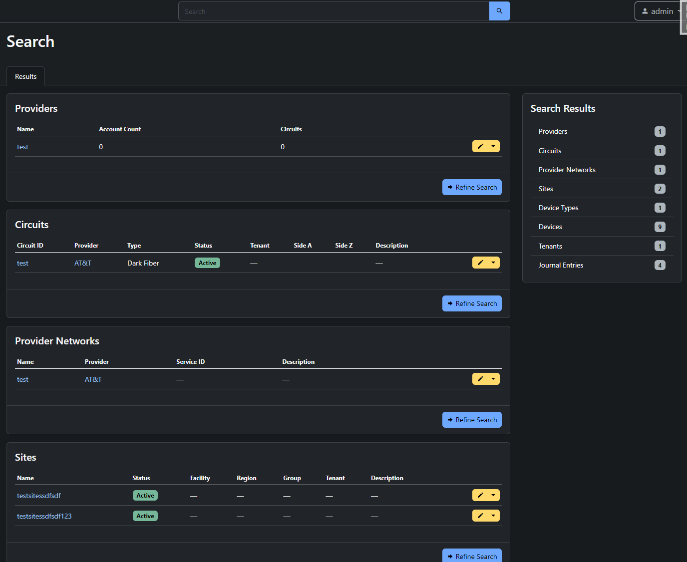

# netbox-old-search [](https://pypi.org/project/netbox-old-search/#description)

This plugin brings back the old global search method that was used in netbox prior to NetBox v3.4.0. The plugin is intended for users that prefer the old search method, or prefers to have the option to use both.

## Version Compatibility

| Netbox        | Plugin   |
|---------------|----------|
| NetBox < 4.0  | <= 0.1.3 |
| NetBox >= 4.0 | >= 1.0.0 |

## Installing

With pip:

```bash
pip install netbox-old-search
```

Then add to `local_requirements.txt`:

```bash
netbox-old-search
```

## Configuration

Enable the plugin in `/opt/netbox/netbox/netbox/configuration.py`:

```python
PLUGINS = [
    "netbox_old_search"
]

PLUGINS_CONFIG = {
    "netbox_old_search": {
        "replace_search": True, # Hijacks the top search bar in netbox, redirecting to this plugins search method instead
        "show_menu": False, # Shows a link to the old search form in the plugin menu
    },
}
```

## Attribution

A lot of the code is repurposed from the [netbox](https://github.com/netbox-community/netbox) source code from before the old search engine was removed.

## Screenshots


